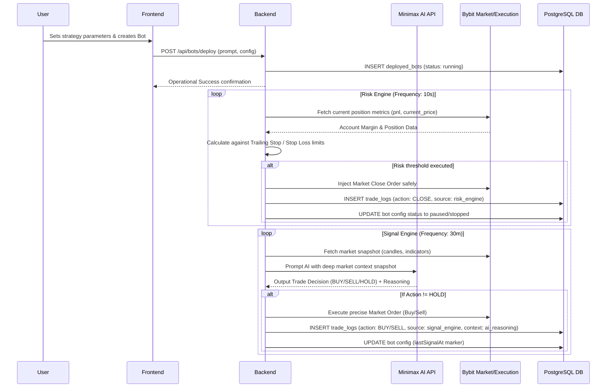

# Product Requirements Document (PRD)

## 1. Overview
Twin Capital Command Center is an executive web application designed for internal teams to monitor and manage crypto trading bots, analyze real-time market data, and execute portfolio strategies. It features a modern, iOS-inspired "Subtle Glass" interface and integrates a Hybrid Auto-Trading Engine that leverages AI for signal generation, alongside a hardcoded risk engine for strict financial safety.

## 2. Requirements
- Secure authentication system including Two-Factor Authentication (2FA) via an Authenticator app.
- Real-time market data integration utilizing Bybit WebSocket for Spot/Linear assets.
- Integrated API Key management for various external platforms (Binance, Bybit, Minimax AI, etc.) securely encrypted with AES-256-GCM in the backend.
- Hybrid Auto-Trading Engine capable of deploying configured strategies, monitoring positions continuously, and enforcing hard constraints to forcefully close trading bots.
- Immersive, dynamic UI/UX equipped with an elegant Light/Dark mode persistent switch.
- Robust media and branding pipeline featuring a Kanban-style board for content lifecycle and AI-powered content generation.
- Scalable, persistent backend state leveraging a solid PostgreSQL database infrastructure.

## 3. Core Features
- **Authentication & Security:** Protected routing with Better Auth, comprehensive session tracking, Two-Factor Authentication (2FA) backup code generation, and activity logging.
- **Dashboard Overview:** At-a-glance portfolio metrics, custom PolyMarket contextual intel blocks, and asset performance tracking.
- **Trading Hub (Command Center):** Bot Status Matrix to view running AI bots, Backtest Hub for evaluating historical performance, real-time Live Execution Logs (FUTURES) panel, and bot management tools to Pause Strategy or Force Close Bot mechanisms.
- **Markets Overview:** Live WebSocket feeds populating dynamic flashing UI components that react to price ticks per millisecond.
- **Assets Management:** Cross-market tracking interface managing both Crypto Spot holdings and traditional Indonesia Stock (IDX) equities.
- **Media & Branding Pipeline:** Dedicated visual Kanban board to govern content status (Backlog → Go Live), integrated multi-platform Cross-Posting Studio, and an AI Content Generator for Text, Image, and Video drafting.
- **Settings & Configuration:** Comprehensive API Key manager facilitating Add/Edit/Test connections, system status readouts, and UI aesthetic preferences.
- **Hybrid Auto-Trading Engine (Phase 5):** A robust dual-loop mechanism. The Signal Engine interfaces with AI to generate strategic trade signals, while the asynchronous Risk Engine handles active stop losses, trailing stops, and profit taking securely on the server side.

## 4. User Flow
1. **Authentication:** User logs in securely with credentials -> Submits 2FA code (if enabled) -> Authenticated session granted.
2. **Dashboard Overview:** User lands on the main Dashboard to review top-level metrics, daily highlights, and total portfolio allocations across spot and derivative margins.
3. **Execution & Monitoring:** User navigates to the Trading Hub -> Reviews the Bot Status Matrix -> Deploys a new Bot equipped with an AI prompt or monitors the immutable trade logs of currently active bots -> Force closes or pauses bots manually if unpredicted risk is perceived.
4. **Market Analysis:** User navigates to the Feed section filtering customized tabs across Spot, Linear, and TradFi arrays, observing real-time dynamic flashes indicating market volatility via Bybit WebSockets.
5. **Asset Tracking:** User navigates to the Assets module reviewing equity health in the spot crypto sub-portfolio and regional (IDX) sub-portfolio. 
6. **Brand Management:** User opens the Media tab, dragging content tickets across the Kanban board pipelines, or prompting the underlying AI engine to compose a new market-related post.
7. **System Configuration:** User switches over to Settings in order to test and inject a new OpenAI API key, monitor granular backend service logs, or adjust their overall user profile configurations.

## 5. Architecture
- **Frontend Structure:** React.js operating over Vite, designed as a highly responsive Single Page Application (SPA).
- **Styling Methodology:** Tailwind CSS merged with custom foundational CSS variables ensuring seamless transition across iOS-Theme modes (Subtle Glassmorphism vs Solid Dark).
- **Backend Architecture:** Node.js Express server establishing robust, modular REST APIs to securely proxy sensitive requests without exposing logic to the client.
- **Database Layer:** PostgreSQL managed through Drizzle ORM specifying strictly-typed schemas.
- **Authentication Proxy:** Better Auth abstracting secure credential, token, and session lifecycles natively natively onto the PostgreSQL layer.
- **Real-time Pipeline:** Direct Bybit WebSocket hookups initialized client-side to guarantee lowest latency GUI rendering, accompanied by backend pooled requests for structural execution logic.
- **Asymmetric Trading Engine:** Detached engine loop logic isolated into a Signal Engine (evaluating context every X minutes) and an independent Risk Engine (polling account margins every Y seconds).

## 6. Sequence Diagram

## 7. Database Schema

The core PostgreSQL application logic incorporates specialized schemas bridging both infrastructure and feature requirements:

- **Authentication Entities (Better Auth Managed):** `users`, `sessions`, `accounts`, `verifications`, and explicit `twoFactor` instances enforcing stringent session retention policies.
- **Platform Integrity:** 
  - `api_keys`: Contains all associated integration keys (Binance, OpenAi, Bybit) securely packed natively as AES-256-GCM configurations (`encryptedFields`).
  - `activity_logs`: Preserves an immutable platform system audit trail mapping all structural modifications.
- **Portfolios:**
  - `assets_crypto`: Spot crypto positions logging quantity, distinct symbol identities, and initial entry points.
  - `assets_saham`: Equities representations for the regional IDX market mapping lot capacities.
- **Media Content Distribution:**
  - `content_items`: Tracking Kanban pipelines integrating status parameters alongside formatted multi-media assets ready for broadcast. 
- **Auto-Trading System Layer (Phase 5):**
  - `deployed_bots`: Definition state defining AI prompt inputs (`strategyPrompt`), dynamic trailing stop configurations, intervals for the dual loop architecture, and active runtime stats (totalPnl, winCount).
  - `trade_logs`: Highly-protected immutable transactional records tracking autonomous AI choices (`aiReasoning`), snapshot context contexts, precise Bybit P&L attributes, formatting decisions generated natively by both `signal_engine` or the enforcing `risk_engine`.

## 8. Tech Stack
- **Core Frontend Framework:** React 18, Vite.
- **Routing Module:** React Router DOM (v6).
- **Styling Architecture:** Tailwind CSS native utility, Lucide React iconography.
- **Chart Utilities:** Chart.js, react-chartjs-2.
- **Backend Application Logic:** Node.js, Express.js.
- **Database Substrate:** PostgreSQL natively.
- **Database ORM Syntax:** Drizzle ORM cleanly defining all database schemas.
- **Authentication Authority:** Better Auth.
- **Automated External Logic Integration:** Bybit API (V5 Spot/Linear variants), Minimax AI Model Endpoints.
