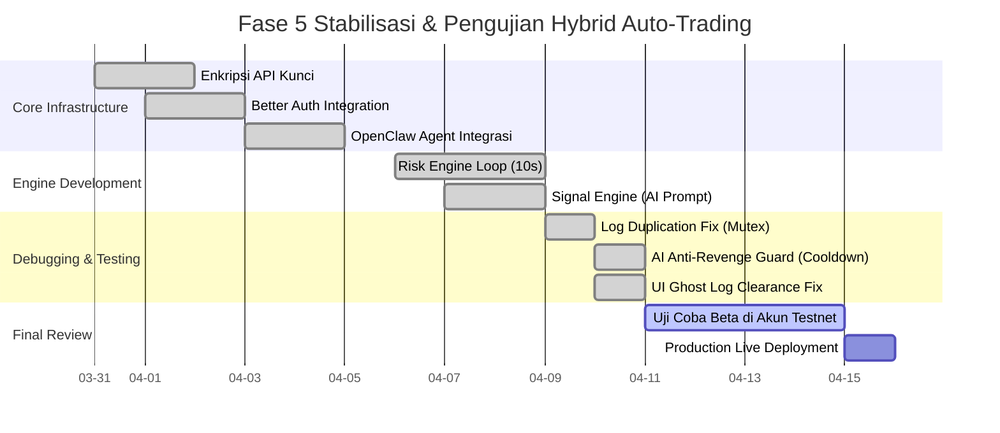

# Project Timeline & Roadmap (Gantt Chart)

Dokumen ini memetakan jejak rekam pencapaian penyelesaian sistem (*milestones*) dari Twin Capital Command Center. Waktu bersifat dinamis (*Agile*).

## Roadmap Pencapaian (*Milestones*)

1. ✅ **Tahap 1: Fondasi Arsitektur** (Selesai)
   - Setup Node.js Monorepo Workspace.
   - Perancangan Drizzle PostgreSQL DB (Tabel Profil, Konfigurasi Bot, Log).
   - Layanan Autentikasi Better Auth & 2FA.

2. ✅ **Tahap 2: Kokpit Estetika UI** (Selesai)
   - Konfigurasi *Layer* React (Vite).
   - Pembangunan komponen *Glassmorphism Premium*, kontrol *dark/light mode*.
   - Integrasi Recharts untuk pelacakan performa.

3. ✅ **Tahap 3: Konektivitas Pasar & Agent** (Selesai)
   - Penarikan Websocket Linear Bybit.
   - Pembangunan API Keys eksternal (AES Encryption).
   - Pengaktifan OpenClaw Autonomous Workspace via Cloudflare Tunnel.

4. 🔄 **Tahap 4 & 5: Hybrid Asymmetric Engine** (Aktif / Pemolesan)
   - *Signal Engine* (AI Analisis Teknis).
   - *Risk Engine* (Kill-Switch drawdowns & Trailing Stops).
   - Pemolesan bug *Ghost logs*, *memory injections*, UX transisi.

## Peta Waktu Siklus Eksekusi Terakhir (Gantt Chart)

Kondisi proyek diukur berdasarkan perbaikan dan stabilisasi *Engine Bot*.

> **Target Peluncuran (*Go-Live*)**: Setelah *Live Testing* dinyatakan steril dari error manipulasi dan SL tereksekusi mulus tanpa macet selama 4 hari (mengakhiri Periode Final Review), Twin Capital akan difinalisasi untuk beroperasi pada aset produksi.
